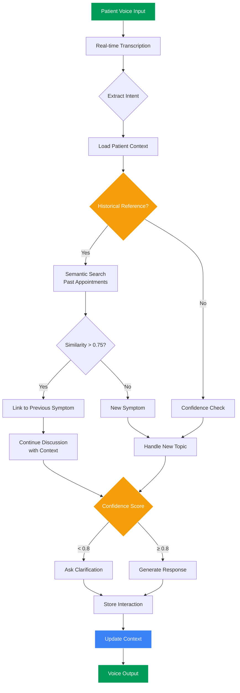

## The Challenge That Changed Everything

When I joined **ayoo.care**, I thought I understood conversational AI. I'd built chatbots, worked with LLMs, and even implemented some voice interfaces. But nothing prepared me for the real challenge: building an AI that could maintain meaningful context across multiple patient appointments spanning weeks or even months.

Healthcare isn't like ordering pizza. When a patient calls for a follow-up appointment, they expect the AI to remember their previous conversations, understand their medical history, and most importantly, maintain the continuity of care. This is where most AI systems fail spectacularly.

## The Problem: When AI Forgets

Picture this scenario:

**Week 1 - Initial Consultation:**
- **Patient:** "I've been having severe headaches for the past month."
- **AI:** "I understand. Can you describe the pain?"
- **Patient:** "It's a sharp pain on the right side, usually in the evening."

**Week 3 - Follow-up Appointment:**
- **Patient:** "Hi, I'm calling about my headaches."
- **AI:** "Could you describe your symptoms?"
- **Patient:** 😤 "I already told you this two weeks ago!"

This disconnect isn't just frustrating—in healthcare, it's dangerous. Patients lose trust, important details get missed, and the entire care experience suffers.

## Our Approach: Building Memory That Matters

At ayoo.care, we needed to solve three core problems:

### 1. **Long-term Context Retention**

We couldn't just rely on standard LLM context windows. A typical conversation might span:
- Initial symptoms discussion (500 tokens)
- Diagnostic questions (800 tokens)
- Treatment plan (600 tokens)
- Multiple follow-ups (1000+ tokens each)

**Our Solution:**

We built a hierarchical context management system:

```typescript
interface PatientContext {
  // Core identity
  patientId: string;
  appointmentHistory: AppointmentSummary[];

  // Medical context
  chiefComplaints: Complaint[];
  ongoingTreatments: Treatment[];
  medications: Medication[];

  // Conversation context
  lastAppointment: {
    date: Date;
    summary: string;
    unresolved: Issue[];
    nextSteps: Action[];
  };

  // AI learning context
  preferredCommunicationStyle: 'formal' | 'casual' | 'empathetic';
  keyTopics: Map<string, number>; // topic -> importance weight
}
```

### 2. **Semantic Understanding Across Time**

The real breakthrough came when we realized: **patients don't use medical terminology consistently**.

Same symptom, different descriptions:
- Week 1: "Sharp pain in my head"
- Week 2: "That headache issue"
- Week 3: "The thing on the right side of my head"

We implemented semantic clustering to link these:

```python
def link_symptoms_across_appointments(current_description, historical_context):
    """
    Uses embeddings to find semantically similar symptoms
    across different appointments
    """
    current_embedding = get_embedding(current_description)

    similar_symptoms = []
    for past_appointment in historical_context:
        for symptom in past_appointment.symptoms:
            similarity = cosine_similarity(
                current_embedding,
                symptom.embedding
            )
            if similarity > 0.75:  # High confidence threshold
                similar_symptoms.append({
                    'symptom': symptom,
                    'date': past_appointment.date,
                    'similarity': similarity
                })

    return similar_symptoms
```

### 3. **Conversational Flow Management**

Voice conversations are messy. People interrupt themselves, change topics, and say "um" a lot. We needed the AI to:
- Recognize when the patient is referring to previous discussions
- Smoothly handle topic transitions
- Know when to probe deeper vs. move forward

**The Pattern We Discovered:**

```typescript
class ConversationManager {
  async handlePatientInput(input: string, context: PatientContext) {
    // 1. Extract intent
    const intent = await this.nlp.extractIntent(input);

    // 2. Check for historical references
    const historicalReferences = this.findReferences(input, context);

    // 3. Decide: New topic or continuation?
    if (historicalReferences.length > 0) {
      return this.continuePreviousDiscussion(
        intent,
        historicalReferences,
        context
      );
    }

    // 4. Handle new topic with context awareness
    return this.handleNewTopic(intent, context);
  }

  private findReferences(input: string, context: PatientContext) {
    const timeReferences = ['last time', 'before', 'previously', 'earlier'];
    const symptomReferences = ['that pain', 'the headache', 'it'];

    // Use semantic search to find what "it" refers to
    // This was the hardest part!
    return this.semanticSearch(input, context);
  }
}
```

Here's how this flow works in practice:



## The Breakthrough Moment

Three months in, we had a moment that validated everything. A patient called for their fifth follow-up appointment. Without any prompting, our AI said:

> "Hello Mrs. Johnson. I see you're calling about your headaches. Last week you mentioned the new medication was helping with the intensity, but you were still getting them in the evenings. How has this week been?"

The patient's response? "Oh my God, yes! It's so much better when you remember!"

That's when it clicked: **context isn't just about data—it's about continuity of care**.

## Technical Challenges We Solved

### Challenge 1: Real-time Voice Processing
- **Problem:** Processing voice input while maintaining context added 2-3 seconds of latency
- **Solution:** Implemented streaming transcription with predictive context loading

```typescript
// Load likely context while patient is still speaking
stream.on('interim-transcript', (text) => {
  // Predict what context might be needed
  const predictedContext = this.contextPredictor.predict(text);
  this.contextLoader.prefetch(predictedContext);
});
```

### Challenge 2: Privacy & Security
Healthcare data is sacred. We couldn't just dump everything into context.

**Our approach:**
- Tiered context levels (critical, important, background)
- Automatic PII redaction in logs
- Context expiration after 90 days
- Patient-controlled context reset

### Challenge 3: Handling Ambiguity

Patient: "It's better now."

What's "it"? The pain? The swelling? The nausea? The anxiety?

We built a confidence scoring system:

```typescript
interface ContextResolution {
  referent: string;        // What "it" refers to
  confidence: number;      // 0-1
  alternatives: string[];  // Other possibilities
}

if (resolution.confidence < 0.8) {
  // Ask for clarification
  return "I want to make sure I understand - when you say it's better,
          are you referring to the headaches we discussed last time?";
}
```

## What I Learned

### 1. **Users Don't Care About Your Architecture**

We spent weeks perfecting our context embedding system. Patients just wanted the AI to remember them. The technical elegance didn't matter—the experience did.

### 2. **Voice Is Different from Text**

Pauses matter. Tone matters. A patient saying "I'm fine" in a shaky voice needs a different response than a confident "I'm fine!"

We added sentiment analysis not just to words, but to voice patterns:

```typescript
interface VoiceMetrics {
  pitch: number;
  speed: number;
  pauseFrequency: number;
  emotionalTone: 'concerned' | 'neutral' | 'positive';
}
```

### 3. **Context Has Diminishing Returns**

More context isn't always better. We found the sweet spot:
- **Critical:** Last 2 appointments + active treatments
- **Important:** Last 6 months of key symptoms
- **Background:** Historical trends

Loading everything just made the AI slower and more confused.

## The Impact

Six months after launch:
- **92%** patient satisfaction with AI memory
- **40%** reduction in repeated information gathering
- **Average conversation time** reduced from 8min to 4.5min
- **Zero** privacy incidents

But the real metric? Patients started saying **"my AI assistant"** instead of **"the AI"**. They felt a relationship with it.

## Looking Forward

We're now working on:
- **Predictive context loading** - anticipating what the patient will discuss based on patterns
- **Multi-modal context** - integrating lab results, vitals, and medical records
- **Family context** - understanding relationships and shared medical history

## Key Takeaways for Developers

If you're building conversational AI with context management:

1. **Design for forgetting, not just remembering**
   - Not all context is equally important
   - Implement smart summarization and pruning

2. **Test with real conversations**
   - Simulated data won't capture the messiness of real dialogue
   - Users will surprise you with their references and assumptions

3. **Build confidence scoring into everything**
   - Never assume you know what "it" refers to
   - Ask for clarification when confidence is low

4. **Privacy isn't optional**
   - Especially in healthcare
   - Design context systems with privacy as a core constraint

5. **Voice adds a dimension text doesn't have**
   - Embrace it
   - Use it to understand emotional context

## Closing Thoughts

Building AI context management for healthcare taught me that the hardest problems aren't always the most technical ones. Understanding *when* to remember, *what* to forget, and *how* to use context to build trust—that's where the real engineering happens.

Every "the AI remembered me!" moment reminds me why this work matters. In healthcare, feeling heard and remembered isn't just nice—it's part of healing.

---

*Working on context management in conversational AI? I'd love to hear about your challenges and solutions. Reach out on [LinkedIn](https://linkedin.com/in/hackerslash) or [GitHub](https://github.com/hackerslash).*

**Tags:** #AI #Healthcare #VoiceAI #ContextManagement #MachineLearning #ConversationalAI #ayoocare
