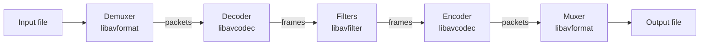

Most people meet FFmpeg as a command line they copied off Stack Overflow. It works, you move on, and the mental model stays "magic box that converts video."

I had to open the box. Colloquium bundles FFmpeg so a watch party can play whatever file someone drags in, inside a plain HTML `<video>` element. Once three people have to see the same frame at the same moment, you need to know what the box is really doing.

## It's four steps, not one



A file like `.mkv` or `.mp4` is a box. Inside are separate streams for video, audio and subtitles, each squashed down by its own codec such as H.264 or AAC.

The demuxer opens the box and hands out packets, small compressed chunks. The decoder turns packets into frames, actual pixels. Filters change frames. The encoder squashes frames back into packets. The muxer packs them into a new box.

Once you see that, the most useful flag in FFmpeg makes sense:

```sh
ffmpeg -i input.mkv -c:v copy -c:a copy output.mp4
```

`-c copy` skips the two slow steps in the middle. The compressed bits go straight from the old box into the new one, so it runs at disk speed instead of CPU speed. That is a remux. Same video, different box.

## Most files don't need transcoding

Browsers usually reject the box, not the video. An MKV holding H.264 is the same video as the MP4 you want, so repacking it is enough.

The decision is per stream, not per file. Colloquium asks `ffprobe` what is inside, then asks the browser what it can play:

```ts
return {
  video: video ? (caps.mp4Video(videoCodec) ? "copy" : "encode") : "copy",
  audio: audio ? (caps.mp4Audio(audioCodec) ? "copy" : "encode") : "copy",
  container: "hls",
};
```

Usually one stream needs work and the other doesn't. HEVC video with a DTS soundtrack copies the video and re-encodes only the audio on a Mac, because Safari's engine plays HEVC natively. The same file on a Windows machine without the HEVC extension has to re-encode both. Asking the browser beats guessing from the operating system, which is how you avoid transcoding on every Mac for nothing.

## Seeking is the hard part

Video isn't stored frame by frame. It comes in chunks that open with one full picture, the keyframe, followed by frames that only record what changed. So you can't just start at any second you like.

Ask for 7 seconds in while copying:

```sh
ffmpeg -ss 7 -copyts -i input.mkv -c:v copy ...
```

and FFmpeg quietly starts at the keyframe before that. If the chunks are 10 seconds long, you get 0 instead of 7. One viewer never notices. Three viewers each land somewhere different and the film falls out of sync.

You can't calculate where you actually landed either. I tried. Re-encoded audio doesn't begin on the video keyframe, so the durations don't add up. The answer is to stop calculating and ask:

```sh
ffprobe -show_entries format=start_time -of default=nw=1:nk=1 index.m3u8
```

`-copyts` in the earlier command is what makes this work. It keeps the file's original timestamps instead of resetting them to zero. Send that number to everyone and each player offsets from it.

If you're re-encoding anyway, you get to pick where keyframes land. `-force_key_frames expr:gte(t,n_forced*4)` puts one every 4 seconds so segments always start cleanly.

## The output side has settings that matter

```sh
-f hls -hls_time 4 -hls_playlist_type event \
-hls_flags independent_segments+temp_file \
-hls_segment_type fmp4 -hls_fmp4_init_filename init.mp4
```

`temp_file` writes each segment under a temporary name and renames it once finished. Renaming is atomic, so the server sharing that folder can never hand out a half written file. Tiny flag. The whole thing breaks without it.

Something nobody warns you about: FFmpeg isn't a player, so it reads as fast as it possibly can. On a 1.6 GB file I got 19.5 minutes of video in the first 30 seconds, around 91 times realtime, pulling 130 Mbit/s. It was stealing bandwidth from the video call the film was playing into. `-readrate 1.5` caps it at 1.5x realtime, with an initial burst so playback still starts quickly.

## The binary is a decision too

`./configure` decides what your FFmpeg can even do. The flag that matters is `--disable-autodetect`. Without it, configure quietly links against whatever is installed on the build machine, like Homebrew's x264, and you ship a GPL binary by accident.

Most codecs already live inside libavcodec. I turned on the operating system's own video frameworks and nothing else, and each binary came out at 13 MB. The popular prebuilt ones are 113 MB, packed with codecs I'd never call.

## When it breaks

Knowing the stages tells you where to look. A file that won't open is the demuxer. A green or stuttering picture is the decoder. Audio drifting after a seek is timestamps. A player rejecting a file that looks fine is usually the muxer or the codec settings.

Run `ffprobe` first. Everything after that is just a decision about what it told you.
